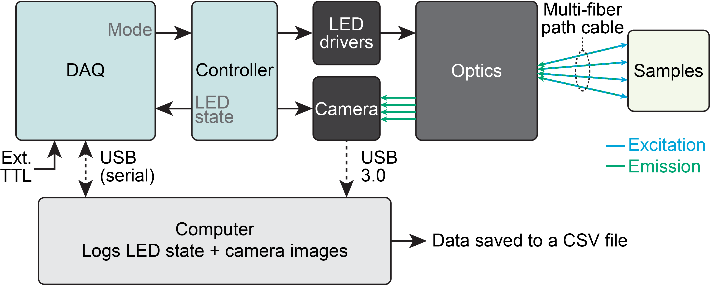
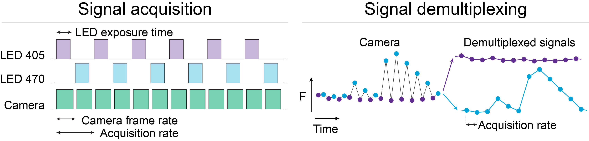

# Multi-fiber Fiber Photometry System (FP V3)

A fiber photometry system that records from more than one fiber at a time. The optics
follow an epifluorescence microscope design, except that the excitation light is focused
onto the back of a multi-core patch cable and the light emitted by each fiber core is
imaged onto a camera.

Two microcontrollers run the system:

- a **controller** that sets the timing of the light sources and the camera acquisition;
- a **DAQ** that reports the state of the light sources to the computer, 

The computer runs a Bonsai to saves the state of the lights sources alongside the 
fluorescence signal from each fiber.

In the standard mode the system alternates violet (405 nm, isosbestic) and blue
(470 nm, signal) excitation, one wavelength per camera frame, at 40 frames per second.
In use in the VBP lab since 2022.

**Please cite:**
Bouchard S, Boutin J, Lévesque M, et al. *Region-specific weighting of sensory intensity
and reward prediction error by dopamine signals.* iScience, 2026; 29.
https://doi.org/10.1016/j.isci.2026.117130

> A STAR Protocols for using this system, implanting the fibers, and training head fixed
mice is in preparation.

---

## Contents

- [1. System overview](#1-system-overview)
- [2. Repository contents](#2-repository-contents)
- [3. Optical path](#3-optical-path)
- [4. Electronics](#4-electronics)
- [5. Software installation](#5-software-installation)
- [6. First-time configuration](#6-first-time-configuration)
- [7. Running a recording](#7-running-a-recording)
- [8. Output data](#8-output-data)
- [9. Validating a recording](#9-validating-a-recording)
- [10. Troubleshooting](#10-troubleshooting)
- [11. Known limitations and to-do](#11-known-limitations-and-to-do)

---

## 1. System overview

<p align="center">

</p>

Two microcontrollers, a camera and a set of LED drivers run the system, with a computer recording the result.

The **DAQ** (Arduino UNO) is the only board connected to the computer. It receives the requested mode from 
Bonsai over USB and passes it to the controller. It also reads the LED sate from the controller and sends it to the computer,
together with the state of an external TTL input (D8) for events from a behaviour system.

The **controller** (Arduino Nano) triggers the **camera** and switches the **LED drivers** so that each frame is illuminated 
by exactly one wavelength.

The **optics** focus the light sources (405 and 470 nm) onto the back of a multi-core patch cable, and the fluorescence 
emitted by the sample returns along the same path to the camera.

The **computer** runs a Bonsai script to extract the mean intensity inside one ROI per fiber and pair it with the LED state, 
and writes everything to a CSV file. 

<p align="center">

</p>

---

## 2. Repository contents

| File | Purpose |
|---|---|
| `FP_camLED_controller.ino` | Controller sketch (Arduino **Nano**). Camera trigger and LED sequencing. |
| `FP_DAQ.ino` | DAQ sketch (Arduino **UNO**). Mode control, per-frame logging, external TTL. |
| `CustomFP_1chan_4Fibers.bonsai` | Bonsai workflow: camera, ROI extraction, serial parsing, CSV writing, live display. |
| `Part Lists/Optical paths.xlsx` | Optical components. |
| `Part Lists/Electronics.xlsx` | Electronic components. |
| `3D print/` | Cases and holders for the Arduinos and the protoboard. |

> **TODO:** add the wiring diagram, an optical path drawing, a photo of the setup, and the
> SpinView settings screenshots (Settings, Image Format, GPIO).

---

## 3. Optical path

Excitation light from a 405 nm LED (isosbestic reference) and a 470 nm LED (signal) passes
through a bandpass filter and a collimating lens (plano-convex, 1 inch focal length). A
longpass dichroic with a 425 nm cut-on combines the two beams. A second longpass dichroic,
cut-on 495 nm, reflects them into the objective (10X air NA 0.25, or 20X air NA 0.4) and
into the fiber.

Light emitted by the specimen returns along the same path, passes through the 495 nm
dichroic, is corrected by an achromat acquisition lens, and is filtered by a bandpass
filter around 535 nm so that only the emitted green light reaches the sCMOS camera.

The 405 nm channel serves as the isosbestic point for most sensors used here, and is used
to correct the 470 nm signal for motion artefacts. With green detection around 535 nm, the
system works with calcium sensors such as GCaMP8s and GCaMP8f, and with neuromodulator
sensors such as GRAB-NE.

### Assembly

1. Assemble both dichroic cubes: fix the bottom (B1C) and top (B3C) plates, then join the
   cubes with the C4W-CC piece. The optics go in later. Mount the cubes on the board,
   raised 1½ inch on optical posts.
2. Build the excitation arms. In a 1½ inch lens tube (longer tubes allow finer LED
   positioning), insert the bandpass filter for that wavelength — the arrow on its edge
   shows the orientation. Add the collimating lens, flat side toward the LED, about 1 inch
   from the source, which is its focal length. Allow for the LED die sitting slightly
   inside the tube; the exact figure is on the mounted LED's spec sheet. Thorlabs spanner
   tools have graduations that help. Screw each tube into its cube and add the mounted LED.
3. Insert the dichroics and check that both LEDs reach the objective.
4. Assemble the objective: a short lens tube into the cube, the objective adapter around
   the objective and into the tube. The objective must be tight and immobile. Add the cage
   mount and the fiber adapter.
5. Assemble the emission path: the achromat lens the right way round, then the bandpass
   filter in a short lens tube, then the camera. Adjust the fiber adapter in front of the
   objective to get the sharpest image at the camera.

### Alignment

Do this in the dark. Target output is **45–55 µW per fiber per wavelength**, and the fiber
bundle must stay inside the camera frame throughout.

1. Before adding the objective, adjust the dichroics so the paths are aligned.
2. With one fiber, adjust x and y with the CXY1A screws to maximise output power. Repeat
   for every wavelength.
3. With several fibers, repeat step 2 to minimise the power differences between fibers.

---

## 4. Electronics

You will need a half-size protoboard, female BNC connectors and cables. The case is 3D
printed; the model is on the NAS.

### 4.1 Controller (Arduino Nano) — `FP_camLED_controller.ino`

Reads the requested mode on D10–D12 and drives the camera and the LED drivers on a fixed
40 Hz schedule. Upload once; it then runs from any USB power source.

| Pin | Direction | Connected to |
|---|---|---|
| D2 | out | Camera trigger (both cameras, Line 3 in SpinView) |
| D4 | out | 410 nm LED driver, and DAQ D4 |
| D5 | out | 470 nm LED driver, and DAQ D5 |
| D6 | out | 565 nm LED driver, and DAQ D6 |
| D10, D11, D12 | in | Mode lines V, B, G from DAQ D10, D11, D12 |
| GND | — | Common ground with DAQ, camera and LED drivers |

Frame timing at 40 Hz:

```
        │◄────────────── 25.000 ms ──────────────►│
  LED   ┌──────────────────────────────┐          ┌───────────────
        │        24.5 ms excitation    │  500 µs  │  next LED
  ──────┘                              └──────────┘
 Trigger ──────┐                              ┌──────────────────
  (D2)         │  LOW while the LED is on     │
               └──────────────────────────────┘
        ▲ frame start (FALLING edge)
```

Each frame starts exactly one period after the previous one (a fixed schedule, not a
measured delay), so there is no cumulative drift over a long recording.

### 4.2 DAQ (Arduino UNO) — `FP_DAQ.ino`

Connected to the computer over USB. It sets the mode for the controller, watches the LED
driver lines, and prints one line per frame at **250000 baud**.

| Pin | Direction | Connected to |
|---|---|---|
| D4, D5, D6 | in | Taps of the controller's 410 / 470 / 565 driver lines |
| D8 | in | External TTL (e.g. trial start from a behaviour system) |
| D10, D11, D12 | out | Mode lines V, B, G to controller D10, D11, D12 |
| GND | — | Common ground |

Because the DAQ reads the driver lines themselves, the logged LED state is hardware ground
truth, not just what the software intended.

**Pull-down resistors (10 kΩ to GND) are required** on the mode lines at the controller
end, on the LED taps at the DAQ end, and on the external TTL input. Without them, a pin
floats whenever the other board is reset or a cable is unplugged, and reads unpredictably.
Note that opening a serial port resets an Arduino, so this happens every time Bonsai or the
IDE connects.

### 4.3 Modes and serial commands

Send one character to the DAQ, from Bonsai or from the Arduino IDE serial monitor. Upper or
lower case; anything else, including line endings, is ignored.

| Command | Mode (VBG) | LEDs cycled, one per frame | Per-channel rate at 40 fps |
|---|---|---|---|
| `0` | 000 | OFF | — |
| `V` | 100 | 410 | 40 Hz |
| `B` | 010 | 470 | 40 Hz |
| `G` | 001 | 565 | 40 Hz |
| `Y` | 110 | 410, 470 | 20 Hz |
| `M` | 101 | 410, 565 | 20 Hz |
| `C` | 011 | 470, 565 | 20 Hz |
| `X` | 111 | 410, 470, 565 | 13.3 Hz |

The system boots in OFF and stays there until a command arrives, so nothing is illuminated
or triggered until you ask for it. Changing mode restarts the LED cycle at the first
enabled wavelength, which is why each recording block starts on 410.

### 4.4 Line format sent by the DAQ

One line per frame, emitted at the LED onset. With `LOG_TIMESTAMP = true` (the current
setting) there are 8 fields:

```
V,B,G,TTL,mode,FLAG,t_onset,t_ttl
1,0,0,0,110,07,283963284,0
```

| Field | Meaning |
|---|---|
| `V`, `B`, `G` | 1 for the LED that is on for this frame (read from the driver lines) |
| `TTL` | 1 if the external TTL is HIGH now, or rose at any point since the previous frame |
| `mode` | Commanded mode, 3 digits. May lead the LEDs by one frame at a mode switch |
| `FLAG` | Frame counter, 0–99, wraps. Detects lines lost on the serial link |
| `t_onset` | Arduino `micros()` at the LED onset of this frame |
| `t_ttl` | Arduino `micros()` of the TTL rising edge reported on this line, 0 if none |

Setting `LOG_TIMESTAMP = false` drops the last two fields; the Bonsai workflow expects
them, so leave it as it is.

---

## 5. Software installation

### 5.1 Arduino

1. Install the Arduino IDE.
2. In **Tools → Board → Boards Manager**, install the board package for your Nano.
3. Upload `FP_camLED_controller.ino` to the **Nano** and `FP_DAQ.ino` to the **UNO**.
   Check the COM port for each before uploading. The controller only needs this once.
4. The system can be driven without Bonsai: open the IDE serial monitor on the DAQ's port
   at **250000 baud** and type `Y` (two LEDs) or `X` (three LEDs), or `0` to stop.
   Close the serial monitor before running Bonsai — only one program can hold the port.

### 5.2 Camera (Spinnaker)

1. Install `SpinnakerSDK_FULL_4.2.0.83_x64.exe`. This version works with the current
   Bonsai.Spinnaker package (see https://github.com/bonsai-rx/spinnaker). The installer is
   on the NAS, as Teledyne no longer lists this version publicly.
2. Choose the **full SDK** and the **Application Development** option. The GigE driver
   component can be deselected.
3. Connect the camera and confirm it streams in SpinView.
4. Apply the settings in the screenshots: exposure **16999 µs**, plus the Image Format and
   GPIO pages. Sequencer and Features stay at their defaults.
5. **Trigger settings:** trigger source Line 3, and trigger activation on the **falling**
   edge — the controller's trigger line idles HIGH and goes LOW for the excitation window,
   so the falling edge marks the frame start and the exposure sits inside the LED pulse.
   Rising edge would start each exposure during the dark gap, capturing the *next* frame's
   LED while the row is labelled with the current one.
6. Save the settings as a user profile in SpinView so they survive a reconnection.

### 5.3 Bonsai

Install Bonsai (tested with **2.9.1**): https://bonsai-rx.org/docs/articles/installation.html

In **Tools → Manage Packages**, install:

- `Bonsai.Spinnaker`
- `Bonsai.Vision`
- `Bonsai.Vision.Design`
- `Bonsai.Scripting.Expressions`
- `Bonsai.Gui`
- `Bonsai.Gui.ZedGraph`

---

## 6. First-time configuration

Open `CustomFP_1chan_4Fibers.bonsai` and set:

1. **Camera serial number** in the `SpinnakerCapture` node (dropdown).
2. **COM port** of the DAQ, in the `String` node feeding the `Arduino COM Port` subject.
3. **Recording length** in the `N Frames` node. This is a total frame count, so at 40 fps:
   288000 = 2 h, 144000 = 1 h, 72000 = 30 min. Acquisition stops on its own at this count.
4. **Fiber ROIs** in the `RoiActivity` node. Connect the fibers, then draw one ROI per
   fiber. ROI order sets the column names: ROI 0 → `f0_ch1`, and so on. Label each fiber
   physically with its ID and match the ROIs to those IDs. With fewer than four fibers,
   park the unused ROIs on an empty part of the image.
5. **Check for cross-talk:** block the light in front of one fiber and confirm the other
   ROI values don't change.

The graph windows and their positions are stored in `CustomFP_1chan_4Fibers.bonsai.layout`
next to the workflow. Keep that file with the workflow when copying it.

---

## 7. Running a recording

### Before each session

1. Connect the fibers and measure the **470 nm** output of each: adjust into the 30–50 µW
   range.
2. Start the Bonsai workflow and press the **record toggle**.
3. Adjust the **405 nm** channel with its knob until its trace matches the 470 nm trace in
   the live graphs.
4. Press the record toggle again to stop.
5. If TTLs are to be recorded, confirm the cable is connected to DAQ D8.

### Recording

1. Connect the fibers to the implanted ferrules.
2. Start the Bonsai workflow.
3. Press the **record toggle**. This sends `Y` (410/470) to the DAQ and starts the LEDs,
   the camera and the CSV writing.
4. During the recording, watch the live traces and check that TTLs are being detected.
5. Press the toggle again to stop. This sends `0`, which stops the LEDs and the triggers.
6. **Stop the Bonsai workflow.** A new CSV is only created when the workflow starts, so
   leaving it running puts the next recording in the same file.

Toggling the record button on and off during a session is safe. Each block appears in the
CSV as a continuous run of frames, separated by a gap in the timestamps, and each block
starts on 410.

---

## 8. Output data

One CSV per workflow run, named `FP_1ch_<timestamp>.csv`, with a header row.

| Column | Source | Meaning |
|---|---|---|
| `V`, `B`, `G` | DAQ | LED on for this frame |
| `TTL` | DAQ | External TTL state, as described above |
| `mode` | DAQ | Commanded mode |
| `ts_arduino` | DAQ | `micros()` at the LED onset |
| `ts_arduino_ttl` | DAQ | `micros()` of the TTL rising edge, 0 if none |
| `ts_ch1` | Camera | Camera chunk timestamp, in nanoseconds |
| `f0_ch1` … `f3_ch1` | Camera | Mean pixel intensity in each fiber ROI |
| `Channel` | Bonsai | `410`, `470` or `565`, derived from V/B/G |

To split violet and blue, filter on `Channel` rather than on row parity: the sequence
restarts at 410 after every mode change, so parity is not reliable across blocks.

**Choose one clock and stay with it.** The Arduino and camera clocks differ by roughly
470 ppm, which is about 3.4 s over a 2 hour recording. `ts_ch1` is the one attached to the
images and is the better choice for analysis. `ts_arduino` is the right one for lining up
external TTL events, since `ts_arduino_ttl` comes from the same clock.

---

## 9. Validating a recording

**Channel labelling.** The camera is configured to trigger on the falling edge, which is
the start of the excitation window, so each image corresponds to the LED named on its own
row. Re-check this after any change to the trigger settings or to the controller sketch:
run in `Y` mode and block the 410 nm LED, or turn its driver output down to zero. In the
CSV, every row labelled `410` should then be dark and every `470` row bright. If the dark
rows carry the `470` label instead, the images are offset by one frame from their labels,
which means the trigger activation has been switched to the rising edge.

**Dropped frames.** Within a continuous block, consecutive `ts_arduino` values should
differ by 25000 µs. A 50000 µs step means a frame was lost. Gaps of hundreds of
milliseconds are just the record button being toggled.

**Image and log alignment.** For every row, the change in `ts_arduino` and the change in
`ts_ch1 / 1000` should agree to within a few tens of microseconds. A sudden jump to a full
frame period means the image and log streams have slipped relative to each other, and the
file should be discarded.

**Saturation.** Check that no ROI sits at 255. An ROI mean of exactly 255.0 means every
pixel is saturated and that fiber carries no usable signal. Aim for means around 100–180
by adjusting LED power, exposure or gain. With 8-bit pixels, a mean of 252 leaves almost
no headroom for a fluorescence transient.

---

## 10. Troubleshooting

**One LED never lights, but the mode changes.** Read the V/B/G columns. If they cycle
through all three channels, the fault is downstream of the Arduino: driver power, driver
set to internal instead of TTL/external mode, a loose cable, or the LED itself. If they
only alternate between two, measure the mode line for the missing channel on the
controller side while sending the command.

**Old or truncated lines appear when the workflow starts.** Data left in the port from the
previous session. The workflow drops everything that arrives in the first moments
(`SkipUntil` with a `Timer`); increase the `DueTime` if lines still slip through. Always
press the record toggle off before stopping the workflow, so the DAQ isn't logging while
the port is closed.

**The violet and blue traces drift apart in the display.** This was caused by `Zip` pairing
the two branches by position and queueing the odd frame left over at each toggle. The
display now uses `WithLatestFrom`, which cannot accumulate an offset. If you rebuild the
display, do not go back to `Zip` there. The CSV was never affected.

**A command sent right after connecting has no effect.** Opening the port resets the UNO,
and the bootloader eats anything sent in the first 1–2 s. Wait about 2 s before sending.

**The camera does not trigger.** Check the trigger source is Line 3, the activation edge is
falling, the exposure is shorter than 24.5 ms, and that the camera and Arduino grounds are
connected.

---

## 11. Known limitations and to-do

- **Output TTL on controller D7 is not implemented.** The current controller sketch has no
  D7 output. If a 40 Hz sync pulse for a downstream device is needed, it has to be added.
- **The record button only selects mode `Y`** (410/470). Other modes need a command typed
  into the serial monitor, or a change to the string node in the `Rec button workflow`.
- **The camera-to-serial pairing is positional.** Images and log lines are matched by
  arrival order, not by timestamp. It has held up in testing, but a single dropped frame
  would offset everything after it, which is why the alignment check in section 9 matters.
- **8-bit pixel depth** limits the dynamic range. If the camera supports Mono16, using it
  would give considerably more headroom.
- **Pull-down resistors** are required but easy to forget when rebuilding a rig.

> **TODO:** wiring diagram; optical path drawing; setup photo; SpinView screenshots;
> part list links; description of the analysis pipeline downstream of the CSV.
