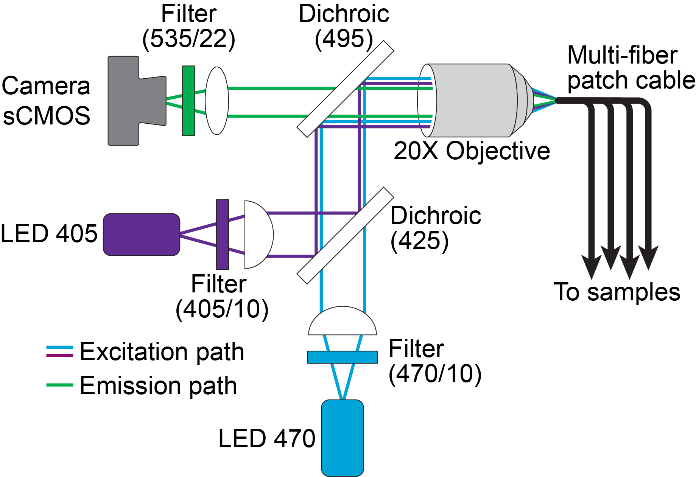
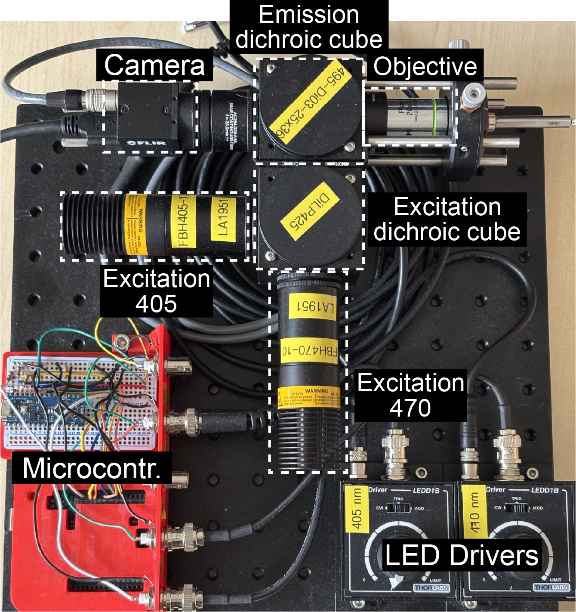
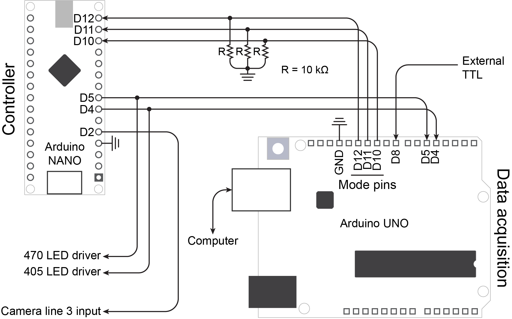
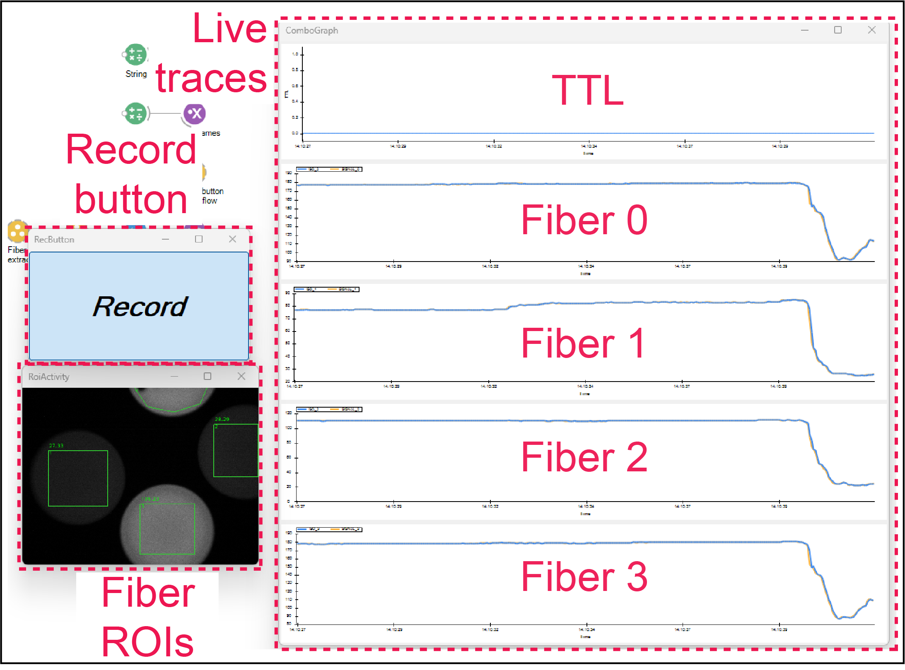

# Multi-fiber Fiber Photometry System (FP V3)

A fiber photometry system that records from more than one fiber at a time. The system 
was developed by the VBP lab and has been in use since 2022.

If you use the system in your research **please cite:**
Bouchard S, Boutin J, Lévesque M, et al. *Region-specific weighting of sensory intensity
and reward prediction error by dopamine signals.* iScience, 2026; 29.
https://doi.org/10.1016/j.isci.2026.117130

> A STAR Protocols paper for using this system, implanting the fibers, and training head-fixed
> mice is in preparation.

---

## Contents

- [1. System overview](#1-system-overview)
- [2. Repository contents](#2-repository-contents)
- [3. Optical path](#3-optical-path)
- [4. Electronics](#4-electronics)
- [5. Software installation](#5-software-installation)
- [6. First-time configuration](#6-first-time-configuration)
- [7. Recording](#7-recording)
- [8. Output data](#8-output-data)
- [9. Validating a recording](#9-validating-a-recording)
- [10. Troubleshooting](#10-troubleshooting)
- [11. Known limitations and to-do](#11-known-limitations-and-to-do)

---

## 1. System overview

<p align="center">


**Figure 1. Overview of system components**
</p>


Two microcontrollers, a camera and a set of LED drivers run the system, with a computer recording the result.

The **DAQ** (Arduino UNO) is the only board connected to the computer. It receives the requested mode from 
Bonsai over USB and passes it to the controller. It also reads the LED sate from the controller and sends it to the computer,
together with the state of an external TTL input (D8) for events from a behaviour system.

The **controller** (Arduino Nano) triggers the **camera** and switches the **LED drivers** so that each frame is illuminated 
by exactly one wavelength.

The **optics** focus the light sources (405 and 470 nm) onto the back of a multi-core patch cable, and the fluorescence 
emitted by the sample returns along the same path to the camera.

The **computer** runs a Bonsai script to extract the mean intensity inside one ROI per fiber and pair it with the LED state, 
and writes everything to a CSV file. 

<p align="center">


**Figure 2. Signal acquisition and demultiplexing.**
</p>

The controller triggers the camera at 40 Hz and alternates the LEDs so that each frame 
is illuminated by exactly one wavelength. The exposure sits inside the LED pulse, and 
each wavelength is therefore acquired at 20 Hz. 

The raw intensity measured in one fiber ROI alternates between the two wavelengths from 
frame to frame. Because the state of every LED is recorded alongside each frame, the trace 
is split afterwards into one signal per wavelength.

---

## 2. Repository contents

| File | Purpose |
|---|---|
| `FP_camLED_controller.ino` | Controller sketch (Arduino **Nano**). Camera trigger and LED sequencing. |
| `FP_DAQ.ino` | DAQ sketch (Arduino **UNO**). Mode control, per-frame logging, external TTL. |
| `CustomFP_1chan_4Fibers.bonsai` | Bonsai workflow: camera, ROI extraction, serial parsing, CSV writing, live display. |
| `Part Lists/Optical paths.xlsx` | Optical components. |
| `Part Lists/Electronics.xlsx` | Electronic components. |
| `3D print/` | Cases and holders for the Arduinos and the protoboard. |

> **TODO:** add the wiring diagram, an optical path drawing, a photo of the setup, and the
> SpinView settings screenshots (Settings, Image Format, GPIO).

---

## 3. Optical path

<p align="center">

</p>

**Figure 3. Optical path.**

Excitation light from a 405 nm LED (isosbestic reference) and a 470 nm LED (signal) passes
through a bandpass filter and a collimating lens (plano-convex, 25 mm focal length). A
longpass dichroic (425 nm) combines the two beams. A second longpass dichroic (495 nm), 
reflects them into the objective (10X air NA 0.25, or 20X air NA 0.4) and
into the fiber.

Light emitted by the specimen returns along the same path, passes through the 495 nm
dichroic, and is filtered by a bandpass filter before reaching the sCMOS camera through 
an achromatic tube lens.

The 405 nm channel serves as the isosbestic point for most sensors, and is used
to correct the 470 nm signal for motion artefacts. With green detection around 535 nm, the
system works with calcium sensors such as GCaMP, and with neuromodulator
sensors such as GRAB-DA or nLightG.

### Assembly

See the [list of optical components](Part%20Lists/Optical%20paths.csv).

<p align="center">

</p>

**Figure 4. The assembled set up.** The optical path, the LED drivers and the microcontrollers
mounted on a single breadboard.

1. **Assemble both dichroic cubes** (Thorlabs #C4W). Fix the bottom plates (B1C). Attach the
   dichroic filter holder (FFM1) to the rotating platform (B3C) and temporarily fix each
   platform on top of the cubes. Join the cubes with the C4W-CC piece. Mount the cubes on
   the breadboard with optical posts.
2. **Build the excitation arms.** In a 1½ inch lens tube, insert the bandpass filter for that wavelength. 
   Add the collimating lens, flat side toward the LED, about 25 mm
   from the source, which is its focal length. Note that a Thorlabs mounted LED sits
   slightly inside the tube; use its spec sheet to calculate the position within the tube.
   Thorlabs spanner tools have graduations that help.

   To check collimation, hold the finished tube about 50 cm from a wall and turn the LED
   on: the spot should be roughly the same diameter as the tube's aperture (1 inch) and
   should not change noticeably as you move the tube closer or further away. A spot that
   grows with distance means the lens is too close to the LED; one that converges first
   means it is too far.
   
   Screw each tube into its cube using a
   lens tube coupler with two retaining rings (SM1T2), then add the mounted LEDs.
3. **Install the dichroics.** Insert the dichroics on each rotating platform (see step 1). The coated side must face
   the light sources. Adjust the angle of each dichroic so that both LEDs reach the
   back aperture of the objective.
4. **Assemble the objective and fiber adapter**. Screw a short lens tube into the cube, then
   the objective adapter around the objective and into the tube. The objective must be
   tight and immobile. Add the cage mount and the fiber adapter.
5. **Assemble the emission path**. Screw in a lens tube coupler with two retaining rings (SM1T2) to the emission dichroic cube.
   Screw in the achromat lens (already mounted in a tube). Insert a
   bandpass filter in a short lens tube and screw next to the achromat, and then the camera. 

### Alignment

Perform these alignment steps in the dark. The target output is **35–55 µW per fiber per
wavelength**, and the fiber bundle must stay inside the camera frame throughout.

1. **Align the dichroics.** Remove the fiber adapter (CXY1A) and place a power meter in
   front of the objective. Turn on the 470 nm LED only and adjust the angle of the 495
   dichroic to maximise the power at the objective, then secure its rotating plate. Next, turn on the 405 nm
   LED only and adjust the angle of the 425 dichroic to maximise the power. Keep this order: the 470 nm path depends only on the 495 dichroic, whereas
   the 405 nm path passes through both.
2. **Focus the fiber adapter on the camera.** Put the fiber adapter back in place and
   connect an optical patch cable. Slide the adapter along the cage rods to move it in Z
   until the fiber face is in focus on the camera, then secure it in place.
3. **Maximise the power in one fiber.** With a single fiber connected, adjust x and y with
   the CXY1A screws to maximise the output power. Repeat for every wavelength. The optimum
   position may differ slightly between 405 and 470 nm; in that case, split the difference
   between the two.
4. **Balance the fibers.** With several fibers connected, repeat step 3 to minimise the
   power differences between them.


---

## 4. Electronics

You will need a half-size protoboard, female BNC connectors and cables. See the [list of electronics](Part%20Lists/Electronics.csv). 
The case is 3D printed; the model is [available here](3D%20print/).

<p align="center">

</p>

**Figure 5. Circuit wiring.** Note: all components should be connected to a common ground.

### 4.1 Controller (Arduino Nano) — `FP_camLED_controller.ino`

Reads the requested mode on D10–D12 and drives the camera and the LED drivers on a fixed
40 Hz schedule. Upload once; it then runs from any USB power source. LED drivers need to be running in trigger mode (TRIG).

| Pin | Direction | Connected to |
|---|---|---|
| D2 | out | Camera trigger (both cameras, Line 3 in SpinView).  For more pin info [click here](https://softwareservices.flir.com/BFS-U3-50S5/latest/50-Quality/GPIOTest.htm)|
| D4 | out | 410 nm LED driver, and DAQ D4 |
| D5 | out | 470 nm LED driver, and DAQ D5 |
| D10, D11, D12 | in | Mode lines V, B, G from DAQ D10, D11, D12 |
| GND | — | Common ground with DAQ, camera and LED drivers |

Frame timing at 40 Hz:

```
        │◄────────────── 25.000 ms ──────────────►│
  LED   ┌──────────────────────────────┐          ┌───────────────
        │        24.5 ms excitation    │  500 µs  │  next LED
  ──────┘                              └──────────┘
 Trigger ──────┐                              ┌──────────────────
  (D2)         │  LOW while the LED is on     │
               └──────────────────────────────┘
        ▲ frame start (FALLING edge)
```

### 4.2 DAQ (Arduino UNO) — `FP_DAQ.ino`

Connected to the computer over USB. It sets the mode for the controller, watches the LED
driver lines, and prints one line per frame at **250000 baud**.

| Pin | Direction | Connected to |
|---|---|---|
| D4, D5 | in | Controller's 410 / 470 driver lines |
| D8 | in | External TTL (e.g. trial start from a behaviour system) |
| D10, D11, D12 | out | Mode lines V, B, G to controller D10, D11, D12. These required pull-down resistors (10 kΩ to ground). |
| GND | — | Common ground |

### 4.3 Modes and serial commands

Send one character to the DAQ, from Bonsai or from the Arduino IDE serial monitor. Upper or
lower case; anything else, including line endings, is ignored.

| Command | Mode (VBG) | LEDs cycled, one per frame | Per-channel rate at 40 fps |
|---|---|---|---|
| `0` | 000 | OFF | — |
| `V` | 100 | 410 | 40 Hz |
| `B` | 010 | 470 | 40 Hz |
| `G` | 001 | 565 | 40 Hz |
| `Y` | 110 | 410, 470 | 20 Hz |
| `M` | 101 | 410, 565 | 20 Hz |
| `C` | 011 | 470, 565 | 20 Hz |
| `X` | 111 | 410, 470, 565 | 13.3 Hz |

The system boots in OFF and stays there until a command arrives, so nothing is illuminated
or triggered until you ask for it. Changing mode restarts the LED cycle at the first
enabled wavelength, which is why each recording block starts on 410.

> **Note.** The controller and the DAQ implement modes for a third excitation source
> (565 nm), but the current setup uses only 405 and 470 nm. 
> 
> Because a 410/10 bandpass
> filter sits in front of the 405 nm LED, this channel is referred to as either 405 or 410
> throughout the system; `410` is the value written in the `Channel` column of the CSV.

### 4.4 Line format sent by the DAQ

One line per frame, emitted at the LED onset. There are 8 fields:

```
V,B,G,TTL,mode,FLAG,t_onset,t_ttl
1,0,0,0,110,07,283963284,0
```

| Field | Meaning |
|---|---|
| `V`, `B`, `G` | 1 for the LED that is on for this frame (read from the driver lines) |
| `TTL` | 1 if the external TTL is HIGH now, or rose at any point since the previous frame |
| `mode` | Commanded mode, 3 digits. May lead the LEDs by one frame at a mode switch |
| `FLAG` | Frame counter, 0–99, wraps. Detects lines lost on the serial link |
| `t_onset` | Arduino `micros()` at the LED onset of this frame |
| `t_ttl` | Arduino `micros()` of the TTL rising edge reported on this line, 0 if none |

---

## 5. Software installation

### 5.1 Arduino

1. Install the Arduino IDE.
2. In **Tools → Board → Boards Manager**, install the board package for your Nano. The system has been tested with the Nano Every board.
3. Upload `FP_camLED_controller.ino` to the **Nano** and `FP_DAQ.ino` to the **UNO**.
   Check the COM port for each before uploading. The controller only needs this once. Take note of the DAQ COM port. The COM port will be requested by the Bonsai script.
4. Test that the DAQ and the system can be driven without Bonsai: open the IDE serial monitor on the DAQ's port
   at **250000 baud** and type `Y` (two LEDs) or `X` (three LEDs), or `0` to stop.
   
### 5.2 Camera (Spinnaker)

1. Install `SpinnakerSDK_FULL_4.2.0.83_x64.exe`. This version works with the current
   Bonsai.Spinnaker package (see https://github.com/bonsai-rx/spinnaker). For VBP lab member, the installer is
   on our NAS. Other users should contact support at Teledyne as they no longer lists this version publicly.
2. Choose, the **full SDK** and the **Application Development** option. The GigE driver
   component can be deselected.
3. Connect the camera and confirm it streams in SpinView.
4. Apply the settings below. Anything not listed stays at its default; the Imaging Format, Processing,
   Sequencer and Features tabs are not modified.
5. Save the configuration as a user set in the camera so it survives a reconnection.

Reference configuration, for a **Blackfly S BFS-U3-04S2M** (firmware 1707.1.6.0):

**Settings tab**

| Setting | Value | Why |
|---|---|---|
| Acquisition Mode | Continuous | |
| Acquisition Frame Rate Enable | unchecked | The frame rate comes from the controller's trigger, not the camera |
| Exposure Mode | Timed | Exposure length is set here, not by the trigger pulse width |
| Exposure Auto | Off | Must be fixed, or the two wavelengths are exposed differently |
| Exposure Time | 16999 µs | Must fit inside the 24.5 ms LED pulse 17ms is what we commonly use. Issues with dropped frame increases with exposure time. |
| Gain Auto | Off | Must be fixed, for the same reason as exposure |
| Gain | 34.3 dB | Adjust per setup; see the note below |
| Gamma Enable | unchecked | Keeps the response linear, which fluorescence quantification requires |
| Black Level | 0 % | |
| Device Link Throughput Limit | 60000000 | |

**GPIO tab**

| Setting | Value | Why |
|---|---|---|
| Trigger Selector | Frame Start | |
| Trigger Mode | On | |
| Trigger Source | Line 3 | The controller's D2 output |
| Trigger Activation | Falling Edge | The trigger line idles HIGH and goes LOW for the excitation window |
| Trigger Overlap | Off | |
| Trigger Delay | 9 µs | Minimum permitted value |
| Line Selector / Line Mode | Line 0 / Input | |

### 5.3 Bonsai

Install Bonsai (tested with **2.9.1**): https://bonsai-rx.org/docs/articles/installation.html

In **Tools → Manage Packages**, install:

- `Bonsai.Spinnaker`
- `Bonsai.Vision`
- `Bonsai.Vision.Design`
- `Bonsai.Scripting.Expressions`
- `Bonsai.Gui`
- `Bonsai.Gui.ZedGraph`

---

## 6. First-time configuration

Close the serial monitor in the Arduino IDE before running Bonsai — only one program can
hold the port.

Open `CustomFP_1chan_4Fibers.bonsai` and set:

1. **Camera serial number** in the `SpinnakerCapture` node (dropdown).
2. **COM port** of the DAQ, in the `String` node feeding the `Arduino COM Port` subject
   (see step 5.1.3).
3. **Recording length** in the `N Frames` node. This is a total frame count, so at 40 fps:
   288000 = 2 h, 144000 = 1 h, 72000 = 30 min. Acquisition stops on its own at this count,
   and can also be stopped manually at any time, so set it longer than you expect to need.
4. **Start the workflow** with F5, or Workflow → Start. Check that the visualizer windows
   appear (see **Figure 6**); if they don't, which is usually the case the first time, see the note below.
5. **Turn the LEDs on** by pressing `Record`, so the fibers become visible. Without a mode
   command the LEDs stay off and the camera image is dark. The command can also be sent
   from the Arduino IDE serial monitor, but not while Bonsai holds the port.
6. **Fiber ROIs** in the `RoiActivity` node. Draw one ROI per fiber. ROI order sets the
   column names: ROI 0 → `f0_ch1`, and so on. Label each fiber physically with its ID and
   match the ROIs to those IDs. With fewer than four fibers, park the unused ROIs on an
   empty part of the image.
7. **Check for cross-talk:** block the light in front of one fiber and confirm that the
   other ROI values don't change.

**Note on visualizer windows**

<p align="center">
  
</p>

**Figure 6. Visualizer windows.** The Explorer panel, lower left, is used to navigate into
each group workflow; double-clicking a node there opens its visualizer while the workflow
runs.

The visualizer windows and their positions are stored in the
`CustomFP_1chan_4Fibers.bonsai.layout` file. If the graphs or the record button do not
appear when you start the workflow, that file is missing or out of date, and the windows
have to be opened manually:

| Window | Where | Node to double-click |
|---|---|---|
| Live traces | `Display Graph` | `ComboGraph` |
| Record button | `Rec button workflow` | `RecButton` |
| Fiber ROIs | `Fiber ROI extraction` | `RoiActivity` |

Use the Explorer panel in the lower left corner to navigate into each group. The workflow
must be running for a visualizer to open.

If double-clicking `ComboGraph` opens an empty window, the individual graphs have to be
added to it: drag each `RollingGraph` node from the `Display Graph` workflow onto the
`ComboGraph` window, starting from the top one (TTL) so they appear in the intended order.

Once all the windows are open and positioned, stop the workflow and save it (Ctrl+S) so
the layout is remembered for next time.

---

## 7. Recording

**Before recording:** Connect the fibers to the fiber adapter. With the LED driver set to constant current mode (CW), measure the **470 nm** output of each fiber. Adjust each of them into the 30–50 µW range. Put back to LED driver to trigger mode (TRIG).

1. Connect the fibers to the implanted ferrules.
2. Adjust the power on the **405 nm** channel:
   2a.Start the Bonsai workflow and press the **Record** toggle button. This sends `Y` (410/470) to the DAQ and starts the LEDs,
      the camera and the CSV writing.
   2b. Adjust the **405 nm** channel with its knob until its trace matches the 470 nm trace in
      the live graphs.
   2c. Press the **Record** toggle again to stop. Stop the Bonsai workflow and delete the files that were saved during the adjustment.
3. Start the Bonsai workflow.
4. Press the **Record** toggle button. This sends `Y` (410/470) to the DAQ and starts the LEDs,
   the camera and the CSV writing.
5. During the recording, watch the live traces and check that TTLs are being detected. If TTLs are to be recorded, confirm the cable is connected to DAQ D8.
6. Press **Record** again to stop. This sends `0`, which stops the LEDs and the triggers.
7. **Stop the Bonsai workflow.** A new CSV is only created when the workflow starts, so
   leaving it running puts the next recording in the same file.

Toggling the record button on and off during a session is safe. Each block appears in the
CSV as a continuous run of frames, separated by a gap in the timestamps, and each block
starts on 410.

---

## 8. Output data

One CSV per workflow run, named `FP_1ch_<timestamp>.csv`, with a header row.

| Column | Source | Meaning |
|---|---|---|
| `V`, `B`, `G` | DAQ | LED on for this frame |
| `TTL` | DAQ | External TTL state, as described above |
| `mode` | DAQ | Commanded mode |
| `ts_arduino` | DAQ | `micros()` at the LED onset |
| `ts_arduino_ttl` | DAQ | `micros()` of the TTL rising edge, 0 if none |
| `ts_ch1` | Camera | Camera chunk timestamp, in nanoseconds |
| `f0_ch1` … `f3_ch1` | Camera | Mean pixel intensity in each fiber ROI |
| `Channel` | Bonsai | `410`, `470` or `565`, derived from V/B/G |

To split violet and blue, filter on `Channel` rather than on row parity: the sequence
restarts at 410 after every mode change, so parity is not reliable across blocks.

**Choose one clock and stay with it.** The Arduino and camera clocks differ by roughly
470 ppm, which is about 3.4 s over a 2 hour recording. `ts_ch1` is the one attached to the
images and is the better choice for analysis. `ts_arduino` is the right one for lining up
external TTL events, since `ts_arduino_ttl` comes from the same clock.

> **Note** We need to add info on how signal is processed. Also include a python script for showing basic processing of data.

---

## 9. Validating a recording

**Channel labelling.** The camera is configured to trigger on the falling edge, which is
the start of the excitation window, so each image corresponds to the LED named on its own
row. Re-check this after any change to the trigger settings or to the controller sketch:
run in `Y` mode and block the 410 nm LED, or turn its driver output down to zero. In the
CSV, every row labelled `410` should then be dark and every `470` row bright. If the dark
rows carry the `470` label instead, the images are offset by one frame from their labels,
which means the trigger activation has been switched to the rising edge.

**Dropped frames.** Within a continuous block, consecutive `ts_arduino` values should
differ by 25000 µs. A 50000 µs step means a frame was lost. Gaps of hundreds of
milliseconds are just the record button being toggled.

**Image and log alignment.** For every row, the change in `ts_arduino` and the change in
`ts_ch1 / 1000` should agree to within a few tens of microseconds. A sudden jump to a full
frame period means the image and log streams have slipped relative to each other, and the
file should be discarded.

**Saturation.** Check that no ROI sits at 255. An ROI mean of exactly 255.0 means every
pixel is saturated and that fiber carries no usable signal. Aim for means around 100–180
by adjusting LED power, exposure or gain. With 8-bit pixels, a mean of 252 leaves almost
no headroom for a fluorescence transient.

---

## 10. Troubleshooting

**One LED never lights, but the mode changes.** Read the V/B/G columns. If they cycle
through all three channels, the fault is downstream of the Arduino: driver power, driver
set to internal instead of TTL/external mode, a loose cable, or the LED itself. If they
only alternate between two, measure the mode line for the missing channel on the
controller side while sending the command.

**Old or truncated lines appear when the workflow starts.** Data left in the port from the
previous session. The workflow drops everything that arrives in the first moments
(`SkipUntil` with a `Timer`); increase the `DueTime` if lines still slip through. Always
press the record toggle off before stopping the workflow, so the DAQ isn't logging while
the port is closed.

**The camera does not trigger.** Check the trigger source is Line 3, the activation edge is
falling, the exposure is shorter than 24.5 ms, and that the camera and Arduino grounds are
connected.

---

## 11. Known limitations

-  **The camera-to-serial pairing is positional.** Images and log lines are matched by
   arrival order, not by timestamp. It has held up in testing, but a single dropped frame
   would offset everything after it, which is why the alignment check in section 9 matters.
-  **Note on dynamic range.** Mono8 gives 256 intensity levels. If your 
   recorded ROI values are sitting at or near 255, where a fluorescence
   transient is clipped and lost, lower the camera gain first. The gain also lowers noise. Then, lower the LED power. The camera supports **Mono16**, which would give
   considerably more headroom and is worth testing with the Bonsai workflow.
